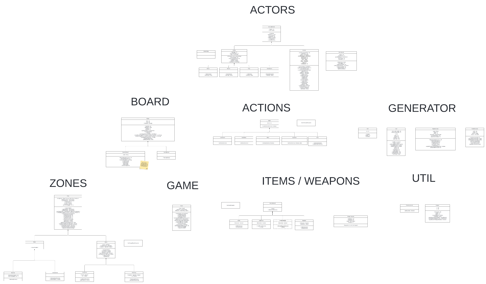
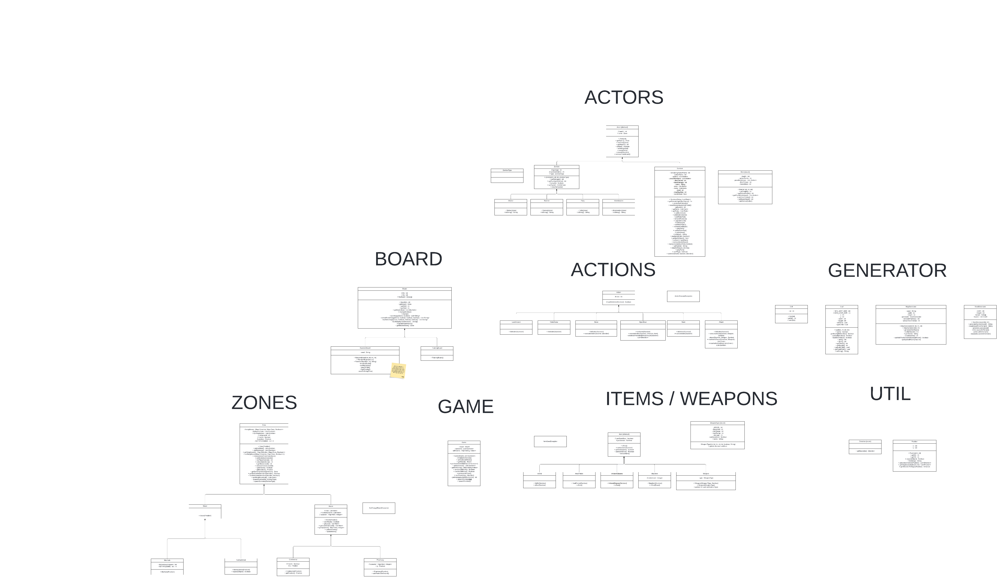
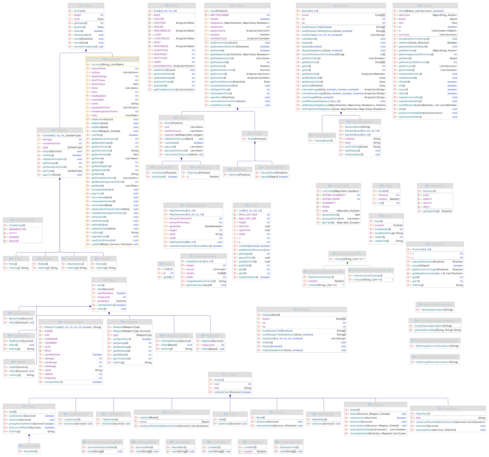

# l2s4-projet-2024

# Equipe

- Louis BECUE
- Hugo BRISOIRE
- Valentin CROGIEZ
- Paul PRUVOST

# Sujet

[Le sujet 2024](https://www.fil.univ-lille.fr/~varre/portail/l2s4-projet/sujet2024.pdf)

# Informations

Ce projet a été développé avec Java 17. Certaines classes pourraient ne pas compiler si vous utilisez une version inférieure.

## Commandes du fichier **Makefile** : 

 (**Attention** : ne pas oublier le classpath).
````bash
export CLASSPATH="src:classes:test:junit-console.jar"
````
 * `doc` -> Crée la JavaDoc.
 * `cls` -> Compile l'emsemble des classes du projet (Contenu dans le fichier `./src`).
 * `zombicide.jar` -> Crée les deux jars pour jouer. (Si il y a une erreur, créer le dossier jar manuellement `mkdir jar`)
 * `clean` -> Supprime tout les fichiers compilés et la documentation.
 * `zone`, `board`, `actor` ... -> Compile le package de la commande.
 * `tests` -> Compile et lance les tests.
 * les livrables :
   * `jar-livarble2` -> Créé le fichier *livrable2.jar*.
   * `livrable2` -> Lance le fichier *livrable2.jar*.
   * `jar-livarble3` -> Créé le fichier *livrable3.jar*.
   * `livrable3` -> Lance le fichier *livrable3.jar*.

## Commandes d'éxecution du programme :
Après avoir exécuté la commande `make jars`, on peut lancer le jeu automatique avec la commande :
```bash
java -jar jar/zombicide.jar <width> <height> <number>
```
ou le jeu interactif avec la commande :
```bash
java -jar jar/zombicide-interactive.jar <width> <height> <number>
```
et en utilisant les arguments suivants : 
* `width` -> la largeur du plateau de jeu
* `height` -> la hauteur du plateau de jeu
* `number` -> le nombre de survivants

# Livrables

## Livrable 1

### Atteinte des objectifs
Algorithme de génération de terrain ✔

### Difficultés restant à résoudre

## Livrable 2

Voici le diagramme UML des classes déjà implémentées dans la version du 11/03/2024 (pour le diagramme UML complet, voir **Semaine 1**). Le format image ne permettant pas une résolution suffisante pour la lecture, préférer la lecture de l'UML sur Lucidchart (onglet **Livrable 2 - UML**) : [lien](https://lucid.app/lucidchart/95e06053-df41-46b5-bc5d-e278d8f55bd2/edit?viewport_loc=-169%2C329%2C14033%2C6519%2CL.KiPuHNxrmb&invitationId=inv_05e3771c-08c0-4618-a71e-46ab10042af0)



### Atteinte des objectifs
* Les classes `SeedGenerator` & `MapGenerator` permettent à présent de créer un plateau rectangulaire complétement aléatoire (`RandomBoard`), en utilisant un algorithme de Binary Space Partioning. Il est possible de passer en paramètre le nombre de pièces spéciales souhaitées (pharmacies et Continental pour l'instant).
* Les survivants et les zombies sont en partie modélisés : il est possible d'en ajouter dans une zone, et de les déplacer.
* Quelques actions ont été implémentées : `OpenDoor`, `Move`, `MakeNoise`, `LookAround`.
* Les rôles ont été implémentés (classe `Role`). Chaque rôle possède des actions spécifiques, un nombre de points d'action, etc. Un rôle de base (`Role.BASE`) contient toutes les actions génériques pour tous les survivants. Chaque action est créée une fois pour chaque rôle (méthode `setActionsInRoles()` de `Game`).
* Concernant les zombies, tous les types de zombies ont été implémentés, avec chacun leurs caractéristiques spécifiques. Il est possible de préciser le type de zombie à générer dans une zone en utilisant le type énuméré `ZombieType` du package `zombie`.
* Le survivant a un sac à dos, dans lequel il est possible de rajouter des objets (de classe `Item`). On peut préciser l'objet à mettre dans la main du survivant pour permettre son utilisation (méthode `useItem(Board, Survivor)` de la classe `Survivor`). Comme certains items ont besoin de paramètres supplémentaires (comme un survivant à soigner pour le kit de soins), il est nécessaire de passer en paramètre tous les paramètres éventuels qu'on pourrait rencontrer en utilisant l'objet dans la main.
* Quelques items ont été implémentés : `AidKit`, `HealPotion`, `MapItem`. Chaque item s'utilise via sa méthode `effect()`, qui prend parfois un ou plusieurs paramètres supplémentaires (cf. point précédent).

### Difficultés restant à résoudre
* Il reste encore quelques items et actions à implémenter.
* Le plus compliqué risque d'être les armes (classe `Weapon`) et notamment de trouver le zombie à atteindre quand on tire dans une direction.
* Aucune structure n'a été faite pour jouer une partie en tant que tel. Il faut commencer au plus vite la réalisation de méthodes comme `playTurn(Survivor)` qui permettront de simuler un tour de jeu pour un survivant donné 
* L'item `InfraredGlasses` nécessite peut-être de retravailler sur les méthodes d'affichage du `Board`, pour permettre l'affichage d'une section spécifique de la carte. En effet, `display()` affiche pour l'instant systématiquement tout le plateau.

## Livrable 3



### Atteinte des objectifs

* Changement de la structure des `Action` : il y a maintenant une distinction entre `doAction()`, générique à toutes les actions et prenant un paramètre commun (le survivant qui fait l'action), et `executeAction()` qui lui s'adapte aux paramètres nécessaires pour la réalisation d'une action. Cette dernière utilise des paramètres déterminés notamment par le package `ListChooser` qui a été ajouté. Toutes les actions ont été implémentées avec cette nouvelle structure. Notons que l'action d'utiliser un item n'est pas de la classe `Action` mais une méthode de la classe `Survivor` : il faudra peut-être modifier ceci pour une plus grande cohérence et pour permettre notamment le choix automatique d'un item à utiliser.
* L'interaction utilisateur et la partie "jouabilité" ont été implémentés, notamment via le package `ListChooser`. La classe `Game` contient par exemple un attribut `ia` permettant de choisir le type de `ListChooser` utilisé.
* Les items ont tous été implémentés et fonctionnent d'après nos tests
* Il est maintenant possible d'afficher une partie restreinte du plateau, ce qui était nécessaire pour l'item `InfraredGlasses` notamment
* Les armes ont été remaniées et fonctionnent comme prévus. L'une des difficultés listées dans le livrable 2 concernant les zones atteignables par une arme a été résolue
* Les méthodes `playTurn()` des survivants et des zombies ont été terminées.

* Le spawn des joueurs utilise une nouvelle méthode de choix de la case de départ
* **Résumé :** toutes les difficultés listées dans le précédent livrable ont été surmontées. Le jeu est donc quasiment terminé et il ne manque plus que du débuggage à faire pour s'assurer que tout fonctionne correctement.

### Difficultés restant à résoudre
* Debug et finalisation du projet
* Mise au propre (refactoring, finalisation de toutes la documentation)

## Livrable 4




### Atteinte des objectifs

* Les actions `TakeInHand` et `UseItem` sont terminées, `Seek` est corrigée, `Heal` et `NosySeek` sont implémentées => Toutes les actions sont terminées et testées.
* Les roles `Healer` et `Nosy` ont maintenant leurs actions attitrées.
* Concernant les Zombies:
  * Les types `Abomination` et `Balaise` font plus (+) qu'un de dégat.
  * Les zombies spawnent désormais lorsqu'une `Room` devient accessible (lorsqu'un survivant ouvre pour la premiere fois une porte d'une Room).
  * On affiche plus d'informations lors de l'attaque des zombies.
* Concernant les Survivants:
  * Ils peuvent gagner un niveau lorsqu'ils tuent un zombie et gagnent un point d'action en fonction de leur niveau.
  * Ils ne peuvent plus attaquer lorsqu'ils se trouvent dans un `Continental`.
  * Une fiole de guérison apparait au sol de la `Pharmacy` dans laquelle un survivant entre.
* Affichage:
  * On n'affiche plus les informations du Continental.
  * L'affichage du listChooser en mode IA a été amélioré.
* Améliorations diverses:
  * Création d'un Enum pour les différents Board (Training, Random, ...).
  * La fonction play dans `Game` a été découpé en plusieurs méthodes pour faciliter la lecture et la compréhension.


* Débuggage des erreurs de compilations.
* Création des fichiers exécutables, mise à jour du Makefile.


### Difficultés restant à résoudre

Il ne reste plus aucune difficulté à résoudre. Le projet est terminé


# Journal de bord

## Semaine 1
Analyse du sujet et mise en place du projet sur Eclipse. Début du diagramme UML (notamment sur la structure des différentes classes).  
[LIEN DU DIAGRAMME](https://lucid.app/lucidchart/95e06053-df41-46b5-bc5d-e278d8f55bd2/edit?viewport_loc=568%2C1185%2C2219%2C1016%2CHWEp-vi-RSFO&invitationId=inv_05e3771c-08c0-4618-a71e-46ab10042af0)

## Semaine 2
Avancé du diagramme UML et commencement du code. Classifications des fichiers en package.

## Semaine 3
Implémentation du Binary Space Partitionning pour la génération de terrain. Réalisation des méthodes d'affichage du plateau.
* Becue Louis : 
  * Debut de code des classes ``Board`` et ``Items``.
* Brisoire Hugo : 
  * Création de l'enum Role, puis création du squelette de Survivors et Zombies
* Pruvost Paul : 
  * Commencement des classes ``Zone``, ``Room`` et ``Street``.
* Crogiez Valentin : 
  * Implémentation du Binary Space Partitionning pour la génération sur un script python (algocreation.py)

## Semaine 4
* Becue Louis :
  * Travail sur l'affichage et résolution de problémes de compilation.
* Crogiez Valentin feat. Brisoire Hugo (mais surtout valentin): 
  * Reflexion sur la création de la seed pour la génération de map aléatoire
* Pruvost Paul : 
  * Avancement du code des classes de la semaine 3 
  * implémentation des classes ``NormalStreet``, ``Manhole``, ``Continental`` et ``Pharmacy``.

## Semaine 5
* Becue Louis : 
  * Implementation complet de l'affichage du ``Board``.
* Brisoire Hugo :
  * Ajout du role BASE
  * Création d'un main GameMainL2, pour tester quelques fonctionnalités.
  * Création de RandomBoard à partir d'une seed
  * Ajout des bâtiments spéciaux (pharmacy, continental) à partir de la seed avec street et rooms. 
  * Création d'une méthode display plus claire mais incomplète (principalement utilisée pour tester le randomBoard)
* Pruvost Paul : 
  * Ajout des méthodes liées aux neighbour (setNeigbours - Zone, updateNeighbours - Board).
  * ajout des tests de updateNeighbours.
  * ajout des javadoc des classes codées par moi-même.
* Crogiez Valentin : 
  * Fin de l'implémentation du générateur de carte aléatoire (package `board.generator`, notamment `SeedGenerator`)

## Semaine 6
* Becue Louis : 
  * Factorisation du code et ajout de méthodes dans les classes des ``Actors``.
* Brisoire Hugo : 
  * Création de MapGenerator, et simplification de RandomBoard. MapGenerator utilise la seed de SeedGenerator, et quelques méthodes précedement créées dans randomBoard.
  * Rédaction de la plupart des docstrings du codé créé par moi-même
  * Création des méthodes liées au spawn de zombie. (modifs dans Game, Board, Zombie)
  * Recréation du diagramme UML qui ne correspondait plus du tout à notre code
  * Création de 17 test dont ceux liés a la création des actors et leur bon fonctionnement (Tous types de roles, tous types de zombies, etc).
* Pruvost Paul : 
  * Ajout des items AidKit, HealPotion, InfraredGlasses, MapItem et de l'exception ItemUsesException.
  * Création des tests de création pour toutes les classes faites moi-même.
  * Ajout de la javadoc de toutes les classes faites moi-même.
* Crogiez Valentin :
  * Création de l'action `Move`, structure des actions des survivants (`Action`)
  * Implémentation des méthodes pour déplacer les acteurs (survivants et zombies)
  * Création de l'action `OpenDoor` pour ouvrir les portes entre deux pièces

## Semaine 7

* Becue Louis :
  * Implementation d'une méthode d'affichage des voisins d'une zone dans la classe `Board`.
* Brisoire Hugo :
  * Classe Game : getSumLevelOfSurvivors,getAverageLevelOfSurvivors, et fonctionnement du spawn de zombies (conformément au cahier des charges)
  * Méthode play dans la classe Game, ainsi qu'une revisite des classes pour initialiser une partie (initializeGame)
  * playTurn de survivor (pas complètement fonctionelle)
* Pruvost Paul :
  * Refonte de la méthode updateNeighbours de Board pour initier les zones adjacentes à null si elles ont un index invalide + division de cette méthode en plusieurs méthodes pour alléger le code.
  * Adaptation de la méthode effect de InfraredGlasses pour utiliser la nouvelle méthode d'affichage des voisins (voir Becue Louis).
* Crogiez Valentin :
  * Changement de la structure des weapons pour que celles-ci héritent de `Item`
  * Debug de la méthode `updateNeighbours` de la classe `Board`
  * Ajout de la "main" du `Survivor` : possibilité de mettre un item dans la main, de l'utiliser

## Semaine 8

* Becue Louis :
  * Création d'une méthode pour accéder à la street du millieu du `Board` pour pouvoir gérer le spawn.
* Brisoire Hugo :
  * Refonte des méthodes playTurn, qui utilisent désormais un objet de la classe ListChooser
  * Création de SurvivorMain qui sert à vérifier le bon fonctionnement de la méthode playTurn de survivor.
* Pruvost Paul :
  * Ajout de méthodes dans Survivor pour enlever l'item en main et pour remplacer l'item en main par un item dans l'inventaire.
  * Ajout de getters et setter dans Item + ajout d'une méthode pour mettre à null le possesseur d'un item.
  * Modification de tous les objets (dont la modification est nécessaire) pour les supprimer de l'inventaire de leur possesseur une fois qu'ils ont été utilisés.
* Crogiez Valentin :
  * Début du code de la classe `Attack`, avec notamment la création de la méthode `reachableZones` pour trouver les zombies atteignables par une arme (difficultée listée dans le livrable 2)
  * Réflexion sur la structure des `Action` (cf livrable 3)
  
## Semaine 9

* Becue Louis :
  * Résolution de problémes minimes dans la classe `Game` avec Hugo. 
* Pruvost Paul : 
  * Modification de certains Item pour que seuls ceux jugés nécessaire soient supprimés à l'utilisation.
  * Ajout de la javadoc manquante pour quelques méthodes.
  * Ajout de test pour la méthode UpdateNeighbours finit
* Brisoire Hugo :
  * play de game gère désormais la fin de partie (défaite ou victoire des survivants)
  * Ajout de l'actualisation de al liste des survivants dans game (après chaque tour de zombie)
  * Ajout de la méthode cleanBoard() qui reset le bruit dans chaque zone (utilisée en début de tour)
* Crogiez Valentin :
  * Fin du refactoring de toutes les `Action` (voir premier point du livrable 3)
  * Fin et tests de l'action `Attack`

## Semaine 10
* Becue Louis :
  * Conception du livrable 3 avec Paul.
  * Implémenatation de nouvelle méthode pour le livrable 3:
    * `getInformation()` dans la classe `Suvivor`. 
    * `getZombies()` dans la classe `Game`.
* Pruvost Paul :
  * Conception du livrable 3 avec Louis.
  * Hugo est beau.
  * Suppression d'imports inutiles dans la quasi-totalité des fichiers du projet.
* Brisoire Hugo :
  * Gérer le retour en arrière lors des actions avec plusieurs choix
  * Ajout d'un try-catch dans la méthode playTurn de survivant qui permet d'afficher un message dans le terminal plutôt que de mettre fin à la partie
* Crogiez Valentin :
  * Point sur les difficultés restantes à résoudre (deux actions manquantes, bug de l'action `Seek`, ...)
  * Peaufinage de la version interactive du jeu avec Hugo (retour en arrière, méthode `playTurn`)

## Semaine 11
* Becue Louis :
  * Ajout de commandes dans le `Makefile` et update du `Readme.md`. 
  * Ajout de méthode pour l'affichage des portes.
* Brisoire Hugo :
  * Application et correction de l'action Seek qui ne fonctionnait pas dans les cas où : il n'y a pas d'items au sol, ou si utilisée dans une street
  * Modification de l'action OpenDoor qui affiche désormais uniquement les portes actuellement fermées
  * Ajout de l'utilisation des points d'actions du survivant dans ces deux dernières méthodes
  * Ajout de l'affichage des portes.
* Pruvost Paul :
  * Ajout de la classe LootTable qui gère le spawn des items dans chaque zone avec leur probabilité d'apparition
* Crogiez Valentin :
  * Réflexion sur la génération aléatoire des items avec Paul (classe `LootTable`)
  * Ajout de la génération des items lors de l'initialisation de la partie
  * Ajout des actions `TakeItemInHand` et `UseItem`

## Semaine 12
* Becue Louis :
  * Optimasation de l'affichage avec l'IA.
  * Suppression des degats faibles pour les abominations et les fatttys.
  * Correction des problémes de compilation et du `makefile`.
  * Deplacement de la gestion de l'affichage dans une classe `Display` du package *util*.
* Pruvost Paul :
  * Classe LootTable terminée et ajout des tests
  * Ajout de la javadoc de TOUTES les méthodes de TOUTES les classes où il en manquait
  * Correction de la l'action Seek et ajout des tests
  * Suppression du maximum de warnings
  * Ajout d'une fiole de guérison dès qu'un survivant entre dans une pharmacie
* Brisoire Hugo :
  * Redécoupage des méthodes de Game
  * Ajout de l'attribut "hostile" dans les zones et les méthodes qui lui sont liées, pour que les acteurs ne puissent pas attaquer si cet attribut est false
  * Ajout du niveau d'expertise des survivants, ainsi que toutes les fonctionnalités qui lui sont liées
  * Ajout des actions propres aux roles Healer est Nosy
* Crogiez Valentin :
  * Debug des `Role`
  * Finitions sur le projet, ajout des dernières fonctionnalités (comme la génération de bruit lors de `UseItem`)
  * Edition du diagramme UML final